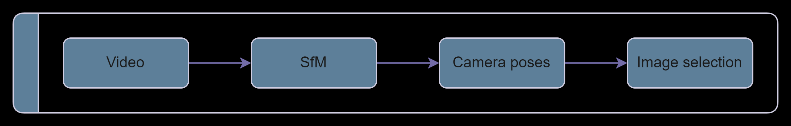

# Structure from Motion Image Matcher

This repository contains a Python script that utilizes Structure from Motion (SfM) techniques to identify and select images nearest to given 3D points.

## Overview

The Structure from Motion (SfM) Image Matcher is a tool designed to streamline the process of selecting images that are the closest match to specified 3D points. By leveraging SfM algorithms, the script can analyze a collection of images and their corresponding camera positions to determine the proximity of each image to the provided 3D points.



## Installation

1. Clone this repository:

```bash
git clone https://github.com/Jonah-gr/SfM-Image-Matcher.git
```

2. Install the requirements:
```bash
pip install -r requirements.txt
```

## How to use

1. Set up the [config file](src/config.py):
Place a video of the object where you like it and change the perspective parameters.
NOTE: PyCOLMAP does not support cuda. To use your GPU anyway, install the right version [here](https://colmap.github.io/install.html). Then copy all the files inside this repository.

2. Run the script:

```bash
python -m src.main
```

Alternatively, use this [notebook](notebook/example.ipynb) and set up all the parameters there.


